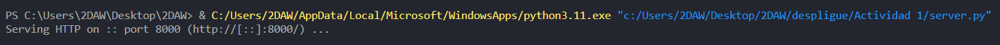
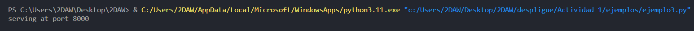

# 1 Visita los siguientes enlaces:

**Simple web server (ejemplo 1)**  
https://docs.python.org/3/library/http.server.html  
python -m http.server 8000  
**http server (ejemplo 2)**  
https://github.com/python/cpython/blob/main/Lib/http/server.py  
**dummy web server (ejemplo 3)**
https://gist.github.com/kabinpokhrel/6fd1275603e9d5f1e284be717cbd1bff

# 2 Instala Python.
Descargamos python desde la tienda de microsoft.  
  
Una vez descargado, ya podemos empezar a usarlo.

# 3 Ejecuta los ejemplos mostrados con anterioridad.
**Primer ejemplo:**  
[Ejemplo 1](./ejemplos/ejemplo1.py)  
**Segundo ejemplo:**  
[Ejemplo 2](./ejemplos/ejemplo2.py)  
**Tercer ejemplo:**  
[Ejemplo 3](./ejemplos/ejemplo3.py) 

# 4 Publica en GitHub los ejemplos llevados a cabo. Los ejemplos se acompañaran con capturas de pantalla en las que se muestre su funcionamiento.
**Captura de pantalla, primer ejemplo:**

**Captura de pantalla, segundo ejemplo:**  

**Captura de pantalla, tercer ejemplo:**  
