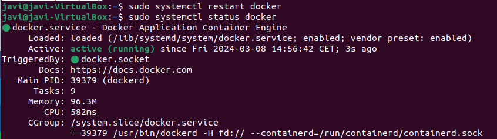
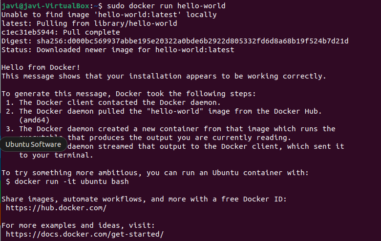
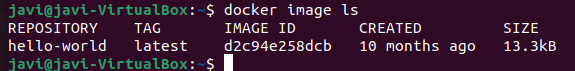
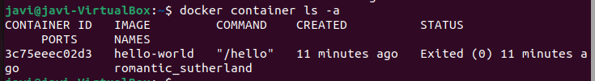
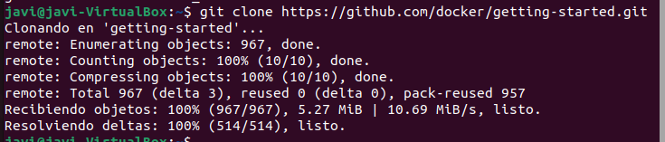
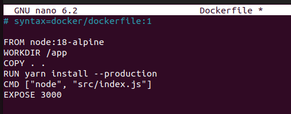
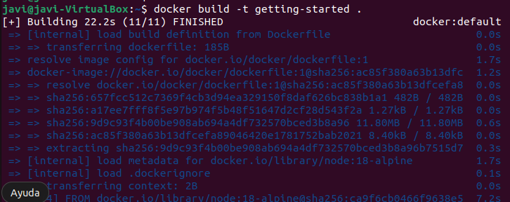
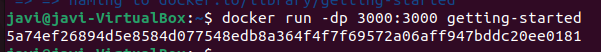

# Ejercicio 2
Primero debemos asegurarnos de que tenemos docker instalado y activado:  


Ahora para empezar el ejercicio debemos ejecutar la imagen hello-world para ello tenemos que usar el comando:
```bash
docker run hello-world
```  
 

- Esto muestra las imágenes Docker instaladas  

Para ver que imagenes tenemos instaladas usaremos el comando
```bash
docker image ls
```
Esto nos hara un listado con el repositorio, la versión descargada, la id de la imagen, cuando se creo y el tamaño que ocupa:  



- Muestra los contenedores Docker

Para ver que nuestros contenedores docker usaremos el comando:
```bash
docker container ls -a
```  


### Primer Dockerfile  
- Edita el fichero Dockerfile  
Primero vamos a  conseguir una aplicación para probar:
```bash
git clone https://github.com/docker/getting-started.git
```  


Hay que editarlo con el comando **sudo nano Dockerfile** tendremos que hacerlo dentro de esta ruta getting-started/app:
```bash
sudo nano Dockerfile
```
```bash
touch Dockerfile

# syntax=docker/dockerfile:1
   
FROM node:18-alpine
WORKDIR /app
COPY . .
RUN yarn install --production
CMD ["node", "src/index.js"]
EXPOSE 3000
```  


- Ahora debemos construir el contenedor:
```bash
docker build -t getting-started .
```  



Para ejecutarlo usaremos este comando:
```bash
docker run -dp 3000:3000 getting-started
```  


