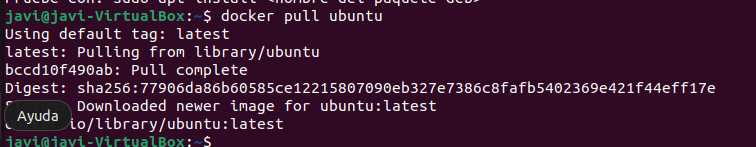
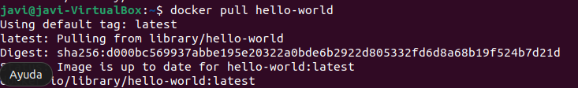
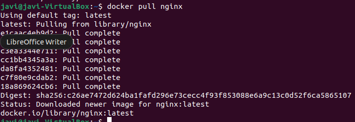
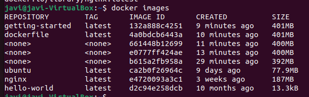
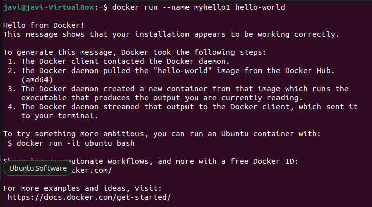
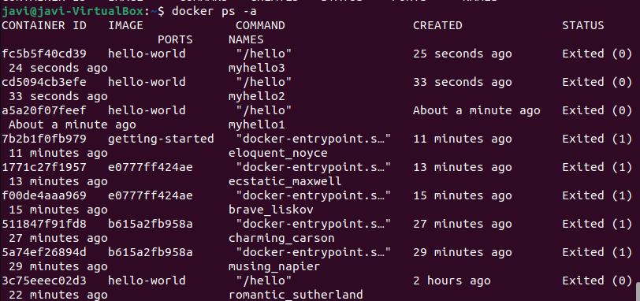
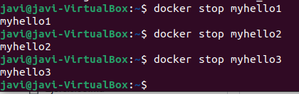
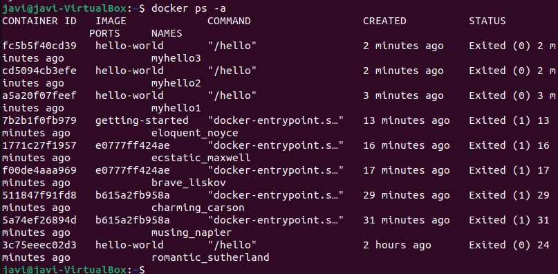
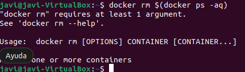

# Ejercicio 3
- Descargamos la imagen de ubuntu  
  
- Después descargamos la imagen de hello-world  
  
- Seguimos con la imagen nginx  
  
- Muestra un listado de todas la imágenes.  
  
- Ejecuta un contenedor hello-world y dale nombre “myhello1”  
  
 Ahora hacemos lo mismo para myhello2 y 3
- Muestra los contenedores que se están ejecutando  
  
- Paramos los contenedor "myhello1 y 2”  
  
- Ahora borramos el contenedor "myhello1”  
  

- Muestra los contenedores que se están ejecutando.  
  

- Por ultimo borramos todos.  
  