# Implementación de Aplicaciones en Docker

En este repositorio se encuentran ejemplos de cómo desplegar diferentes aplicaciones utilizando Docker. Cada ejemplo muestra cómo configurar los servicios necesarios y ejecutar los contenedores correspondientes.

## Ejemplo 1: Aplicación de Registro de Invitados

Vamos a desplegar una aplicación web de registro de invitados que consta de dos servicios: un servicio web y un servicio de base de datos.

### Configuración de Servicios:

- La aplicación de registro de invitados es una aplicación web desarrollada en Python que se sirve a través del puerto 5000/tcp. Utilizaremos la imagen iesgn/guestbook.
- Esta aplicación almacena la información en una base de datos no relacional Redis, que utiliza el puerto 6379/tcp para la conexión. Utilizaremos la imagen de Redis.

### Pasos a seguir:

1. Crear una red compartida para los servicios.
2. Ejecutar el contenedor de Redis.
3. Ejecutar el contenedor de iesgn/guestbook.
4. Verificar el correcto funcionamiento de la aplicación.  

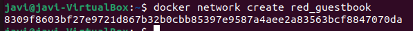  
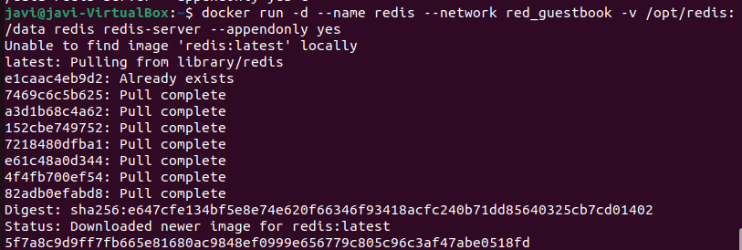  
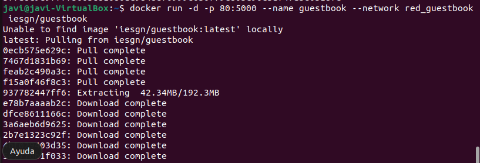  
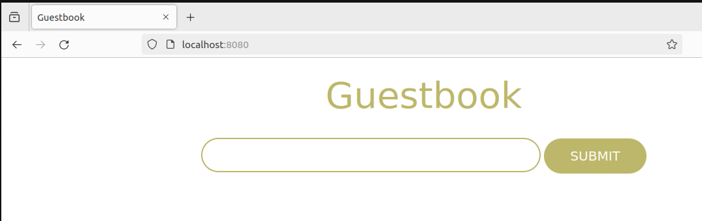  

## Ejemplo 2: Aplicación de Temperaturas

En este ejemplo, desplegaremos una aplicación que permite consultar las temperaturas mínimas y máximas de todos los municipios de España. Esta aplicación consta de dos microservicios: frontend y backend.

### Configuración de Servicios:

- Creamos una nueva red para este propósito.
- Iniciamos el backend.
- Iniciamos el frontend.

### Pasos a seguir:

1. Crear una nueva red para los servicios.
2. Iniciar el backend.
3. Iniciar el frontend.
4. Verificar el correcto funcionamiento de la aplicación.

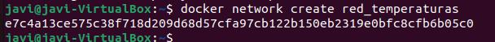  
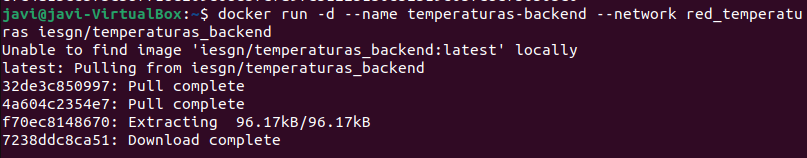  
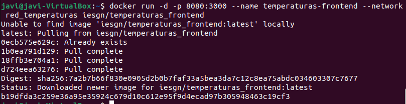  
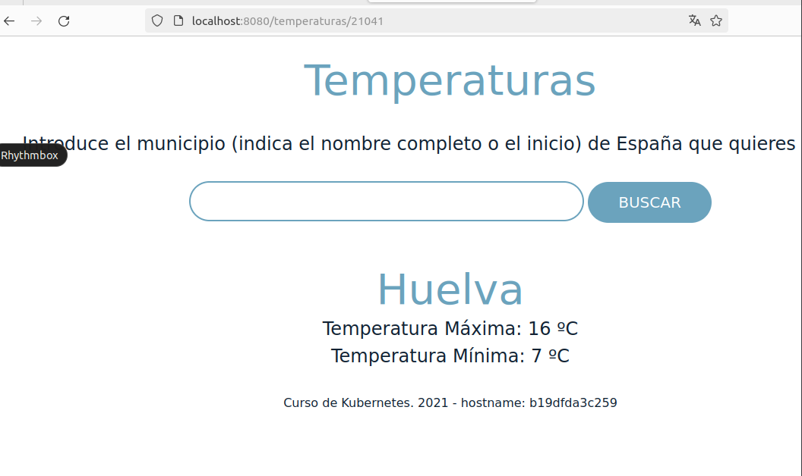  

## Ejemplo 3: Wordpress + MariaDB

En este ejemplo, desplegaremos WordPress junto con una base de datos MariaDB utilizando Docker.

### Configuración de Servicios:

- Necesitamos dos contenedores: la base de datos (imagen de MariaDB) y el servidor web con la aplicación (imagen de WordPress).
- Ambos contenedores deben estar en la misma red y ser accesibles por sus nombres.

### Pasos a seguir:

1. Crear una red para los servicios.
2. Ejecutar el contenedor de MariaDB.
3. Ejecutar el contenedor de WordPress.
4. Verificar el correcto funcionamiento de la aplicación.  

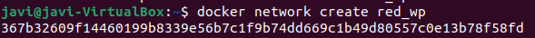  
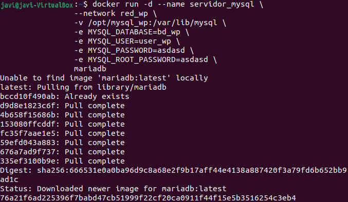  
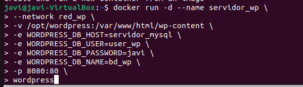  
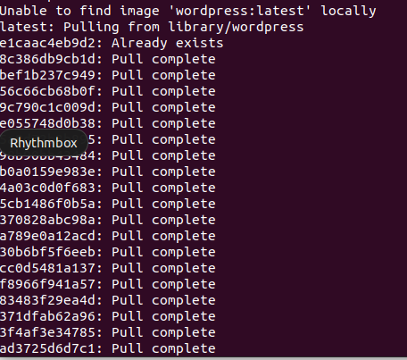  
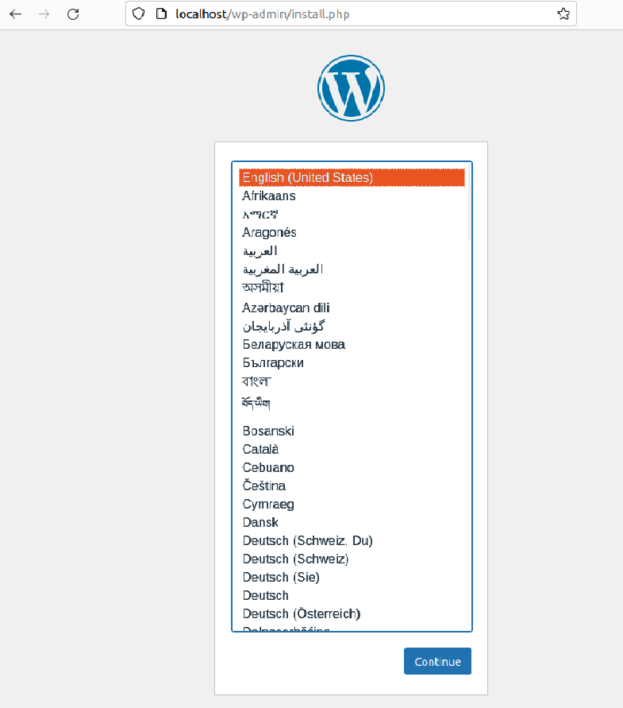  

Cada ejemplo incluye capturas de pantalla que muestran los pasos de configuración y verificación de funcionamiento.

¡Diviértete explorando estos ejemplos de Docker!
