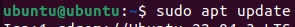
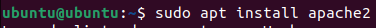

# 1.1 Debemos de instalar Apache:
sudo apt update  
  
sudo apt install apache2  

# 1.2 Abre el archivo hosts en un editor de texto.
sudo nano /etc/hosts

# 1.3 Agregar las siguientes líneas en el sudo nano.
127.0.0.1       centro.intranet  
127.0.0.1       departamentos.centro.intranet  
127.0.0.1       servidor2.centro.intranet  

