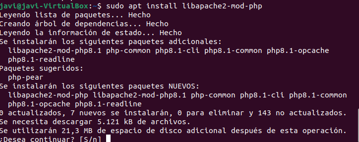
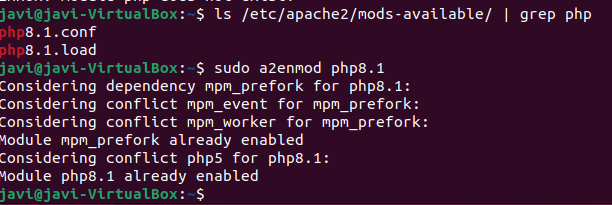
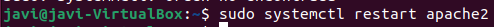
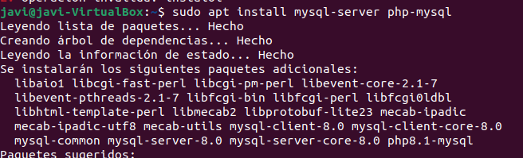
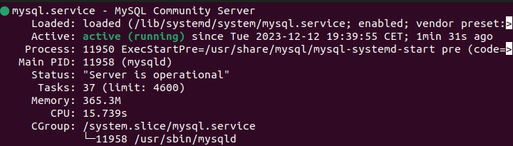

# 2.1 Instala PHP y los módulos necesarios para Apache
sudo apt install libapache2-mod-php
  

# 2.2 Activa el módulo PHP y reinicia Apache
Primero debemos conocer la version de nuestro modulo, para ello podemos hacerlo con:
**ls /etc/apache2/mods-available/ | grep php**

sudo a2enmod php8.1(Habilitar modulo)  
 

sudo systemctl restart apache2  
 

# 2.3 Instala el servidor de bases de datos MySQL
sudo apt install mysql-server php-mysql
 
 

