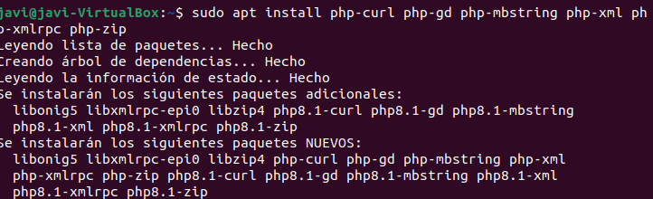
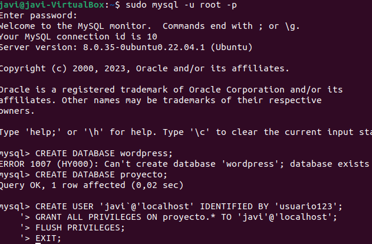
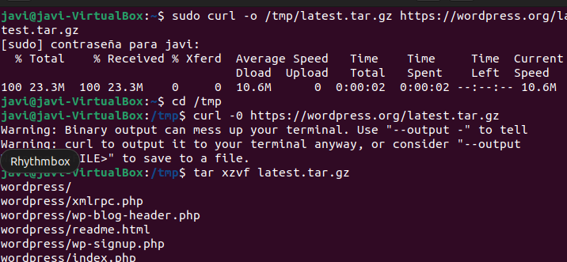
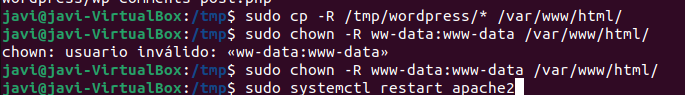

# 3.1 Instala los módulos PHP necesarios para WordPress
sudo apt install php-curl php-gd php-mbstring php-xml php-xmlrpc php-zip  
  

# 3.2 Reinicia el servicio de Apache después de instalar nuevos módulos
sudo service apache2 restart  
  

# 3.3 Descarga WordPress, preparacion del entorno y copia de archivos al directorio web
**Preparacion del entorno**  
  

cd /tmp  
curl -O https://wordpress.org/latest.tar.gz  
tar xzvf latest.tar.gz  
  

# 3.4 Copia los archivos de WordPress al directorio web de Apache
sudo cp -R /tmp/wordpress/* /var/www/html/  
  

# 3.5 Ajusta los permisos para que Apache pueda acceder a los archivos de WordPress
sudo chown -R www-data:www-data /var/www/html/  
  
