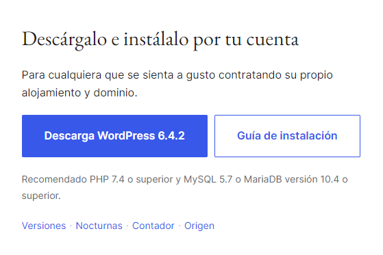
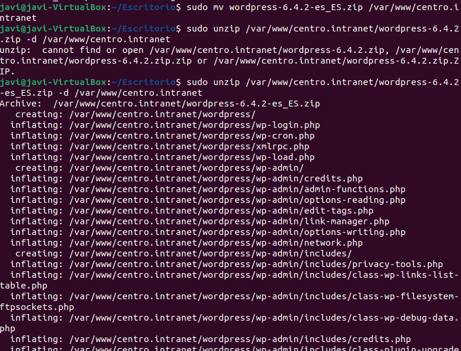
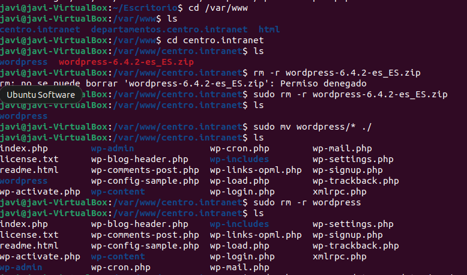
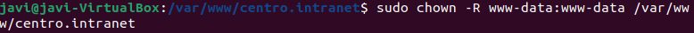
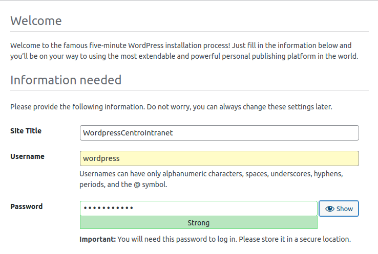
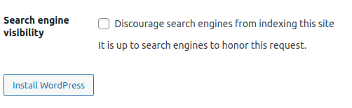

# 3.1 Instala los módulos PHP necesarios para WordPress
sudo apt install php-curl php-gd php-mbstring php-xml php-xmlrpc php-zip  
  

# 3.2 Reinicia el servicio de Apache después de instalar nuevos módulos
sudo service apache2 restart  
  

# 3.3 Descarga WordPress, preparacion del entorno y copia de archivos al directorio web
Para descargar wordpress, tenemos que irnos al a pagina oficial y desde alli descargar la ultima version.

https://es.wordpress.org/download/

  

# 3.4 Descomprimir el archivo .zip
**Preparacion del entorno**  
Para ello debemos mover la carpeta wordpress esta dirección:  /var/www/html/  
y una vez allí la descomprimimos.
  

# 3.5 Borrar el zip de Wordpress
Ahora una vez tenemos descomprimido el archivo, tenemos que borrar el zip y mover el contenido de la carpeta fuera:

  

# 3.5 Ajusta los permisos para que Apache pueda acceder a los archivos de WordPress
Por ultimo tenemos que darle los permisos:  
  

# 3.6 Iniciar Wordpress
Para ello nos vamos al localhost y debería salirnos la pgina de wordpress:  
  

# 3.7 Configuración Wordpress
Ahora nos pedira que agreguemos en la carpeta var/www/html/centro.intranet, un archivo llamado wp-config.php y agregamos esta lineas:  

  

Una vez hecho eso, ponemos los datos necesarios para instalar wordpress:  

  
y le damos a instalar:  
  

Y ya estaria, ya tenemos la pagina web si ponemos en la url:  
**centro.intranet**
  
