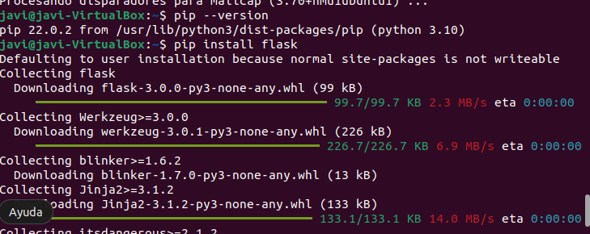
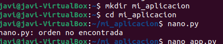
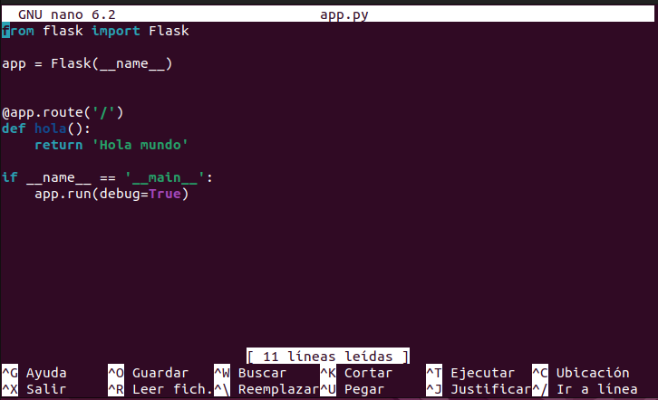
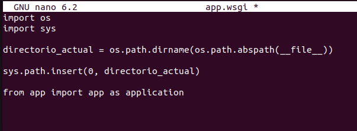
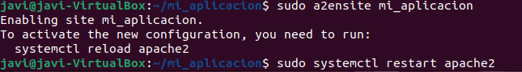

# 5.1 Instalar Flask
pip install flask
 

# 5.2 Crear una aplicación Flask simple
mkdir mi_aplicacion  
cd mi_aplicacion  
nano app.py  

 

# 5.3 Crear un archivo WSGI
nano app.wsgi
 

# 5.4 Configurar Apache
sudo nano /etc/apache2/sites-available/mi_aplicacion.conf
 
 

# 5.5 Habilitar el sitio y reiniciar Apache
 

