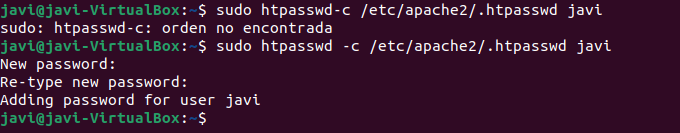
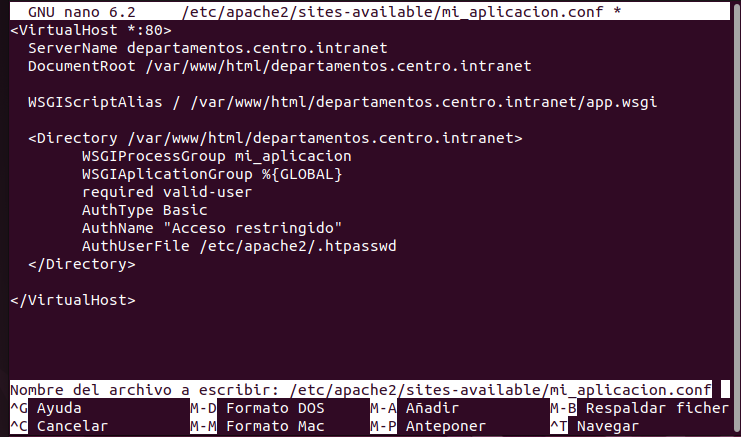

# 6.1 Instalar htpasswd
sudo apt install apache2-utils  

# 6.2 Crear un archivo de usuarios y configurar la autenticación
sudo htpasswd -c /etc/apache2/.htpasswd usuario  
  

sudo nano /etc/apache2/sites-available/departamentos.centro.intranet.conf  

# 6.3 Agregamos esta linea de codigo en Apache.
  

# 6.4 Habilitar el nuevo sitio y reiniciar Apache
sudo a2ensite departamentos.centro.intranet.conf  
sudo systemctl restart apache2