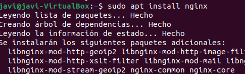
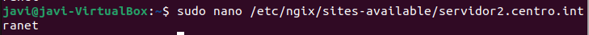
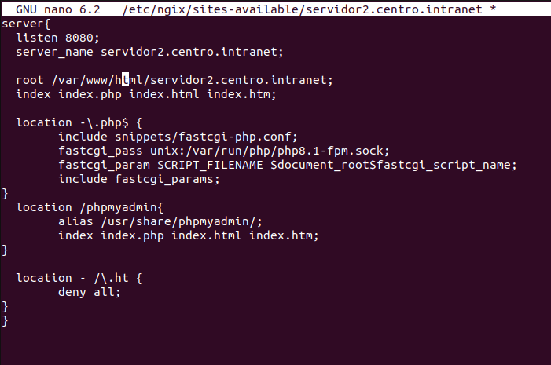
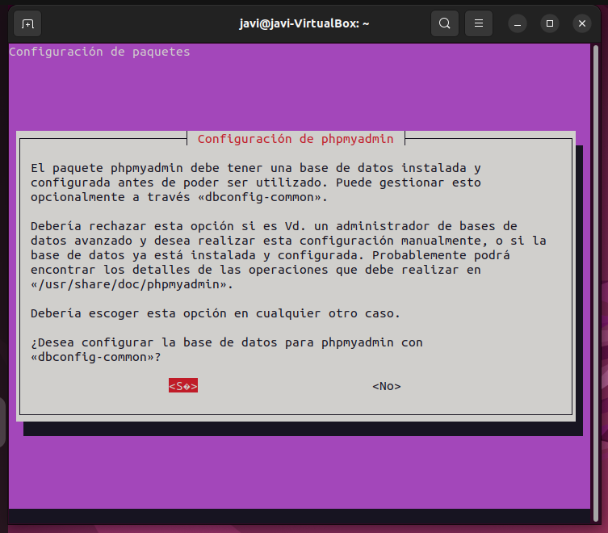

# 8.1 Instalar Nginx
sudo apt install nginx
  

# 8.2 Configurar Nginx
sudo nano /etc/nginx/sites-available/servidor2.centro.intranet
  

# 8.3 Agrega las siguientes líneas al archivo de configuración:
  

# 8.4 Habilitar el nuevo sitio y reiniciar Nginx
sudo ln -s /etc/nginx/sites-available/servidor2.centro.intranet /etc/nginx/sites-enabled/  
sudo systemctl restart nginx

# 8.5 Instalar phpMyAdmin
sudo apt install phpmyadmin  
   
  

# 8.6 Configurar phpMyAdmin
sudo ln -s /etc/phpmyadmin/apache.conf /etc/nginx/conf.d/phpmyadmin.conf  
sudo systemctl restart nginx