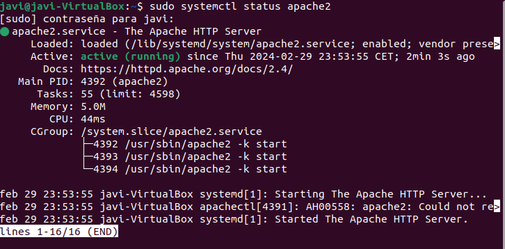
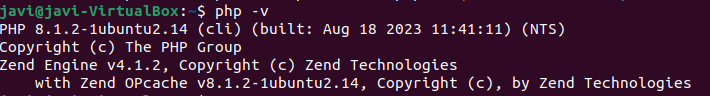
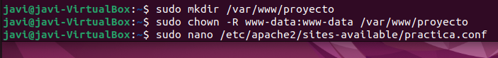
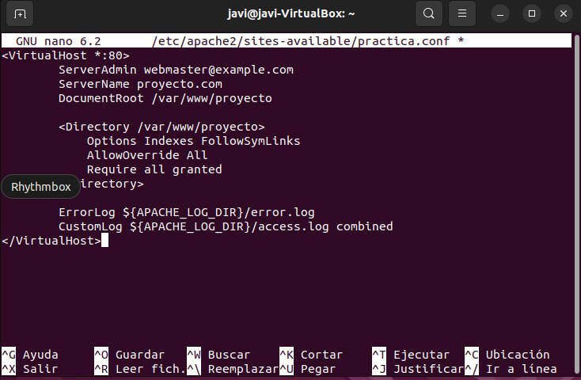
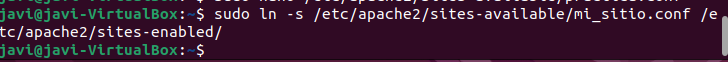
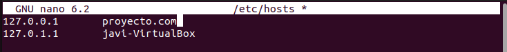
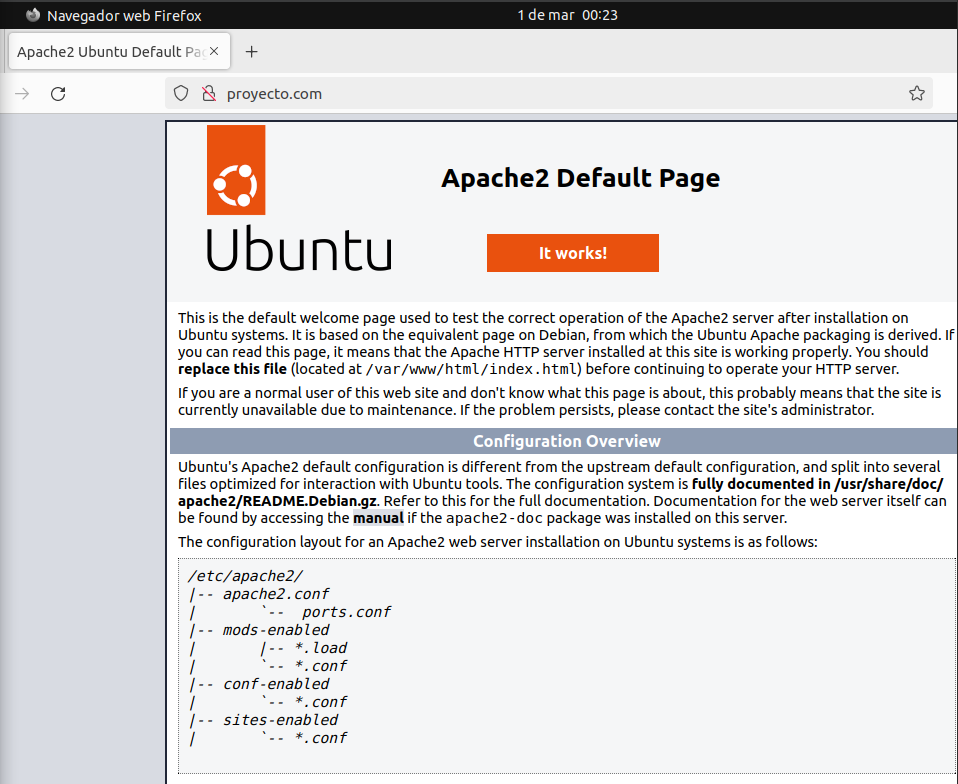

## Apartado 2:
1.Primero  instalaremos Apache ejecutando el siguiente comando:  
```
sudoapt install apache2
```
2.Este comando mostrará el estado de Apache. Si Apache se ha instalado correctamente, debería mostrarse como "active" (activo) en color verde.  


3.Instalamos php con este comando:
```
sudo apt install php libapache2-mod-php php-mysql
```


4.Verificamos que PHP se haya instalado correctamente ejecutando el siguiente comando:


5.Creamos un directorio para el sitio web, le damos permisos al directorio y creamos el archivo de configuracion del virtual host.
 

6.Ahora dentro del nano(archivo de configuración) tenemos que escribir esta linea de comando de ejemplo :
  

7.Lo activamos con este codigo y reseteamos para que se hagan los cambios.


8.Ahora con esta linea de comando entramos en hosts. 


9.Y configuramos la IP para nuestro proyecto. 


10.Ahora nos vamos al navegador y comprobaremos si funciona. 



