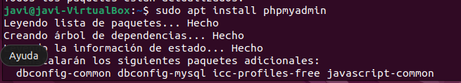
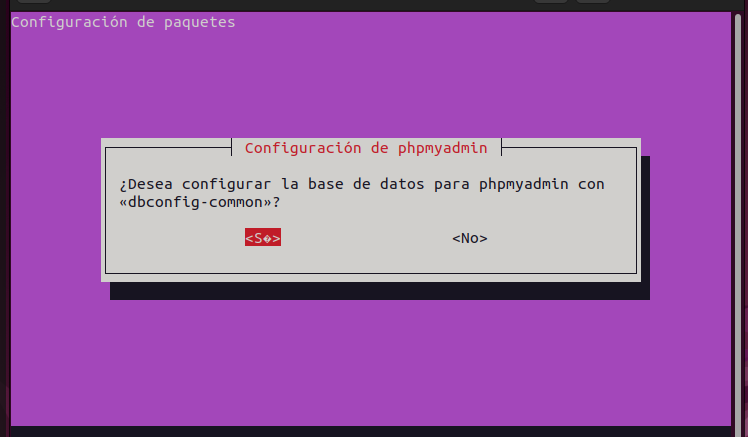
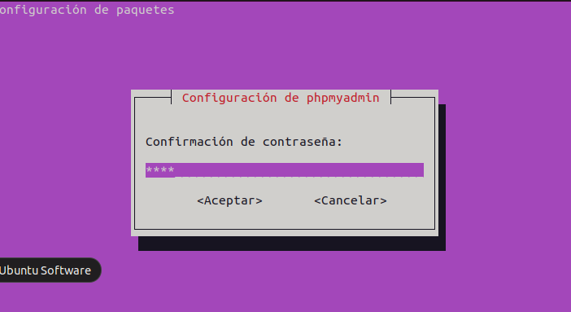
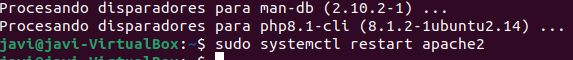

## Apartado 4:
1. Primero instalaremos el phpmyadmin con este comando :  

2. Cuando lo instalemos nos preguntaran si queremos configurarlo le daremos que si y nos dira si queremos intalar la base de datos volveremos a confirmar:  

3. Despues nos pedirá que creemos una contraseña, y la verificamos:  

4. Por ultimo reiniciaremos apache para poder acceder ahora a nuestro phpmyadmin.  

