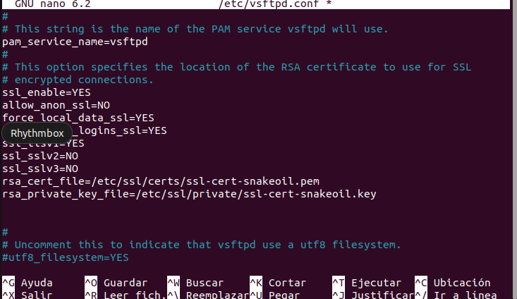

## Apartado 5:
1. Primero instalaremos el servidor vsftp que es de los más comunes y sencillos de configurar:  

2. Entramos en la configuración.  

3. Ahora añadiremos unas lineas para que los clienten puedan conectarse:  

4. Por ultimo reiniciaremos el servicio vsftpd.  

