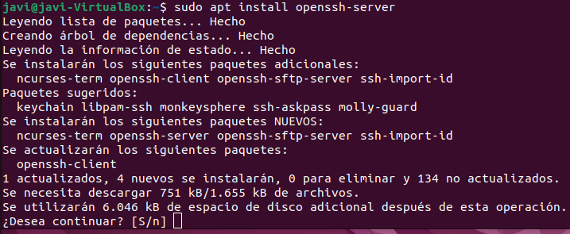
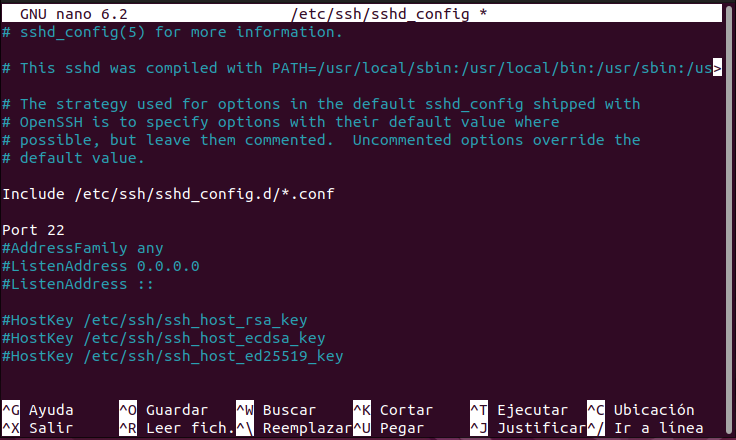
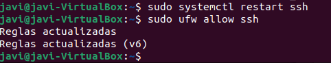

## Apartado 6:
1. Primero instalaremos el servicio de openssh server con este comando:  

2. Ahora editaremos el archivo de configuración:  

3. Eliminaremos esta almohadilla para activar el puerto 22 por defecto:  

4. Por ultimo reiniciaremos el servicio para que aplique las configuraciones y active el puerto.  

