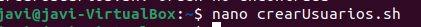
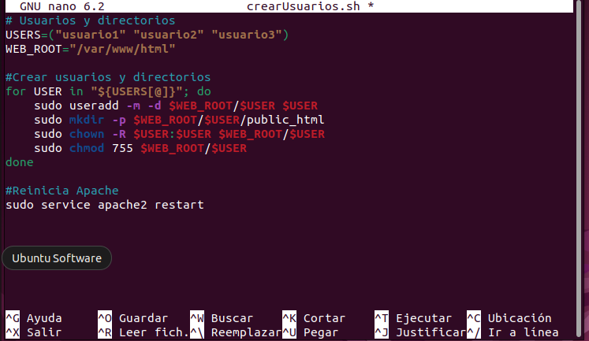
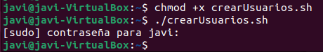
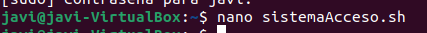
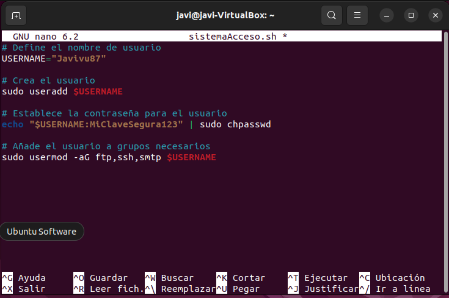
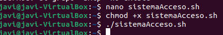

## Apartado 7:
1.Para empezar creamos el archivo para crear los usuarios:  

2.Ahora debemos automatizarlo con este script.

3.Guardamos y le damos permisos y ejecutamos:  

4.Hacemos lo mismo para el acceso, ftp, ssh y stmp, creamos el archivo:

5.Automatizamos con este script.  

6.Le damos permisos y ejecutamos:

