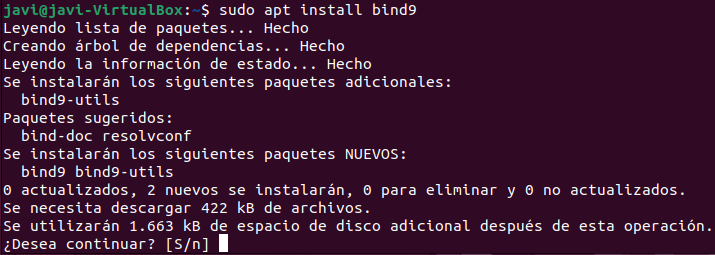
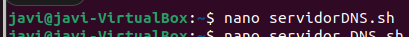
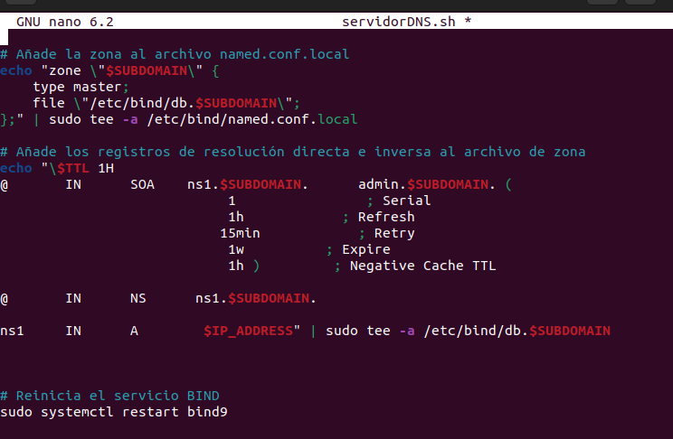
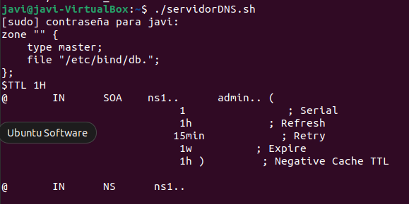
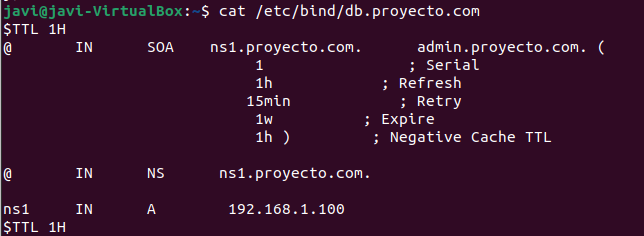

## Apartado 8:
1.Para el siguiente Script, debemos instalarnos bind:  

2.Ahora creamos el archivo para elservidor DNS.

3.Una vez creado tenemos automatizar los servidores DNS con este Script:  

4.Le damos permisos y lo ejecutamos.

5.Para ver si se ha ejecutado bien podemos usar el comando cat.  

