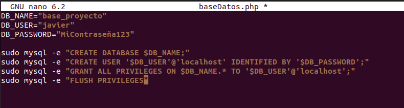
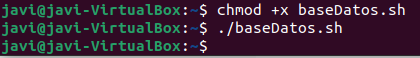
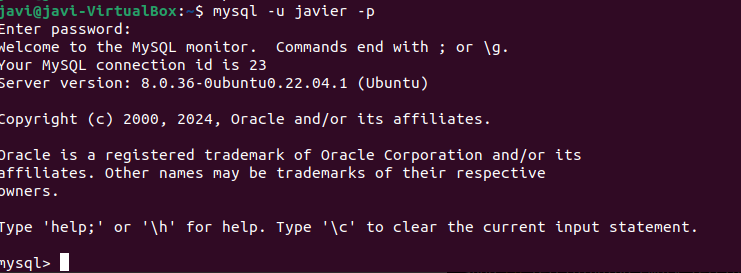
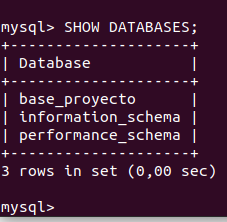
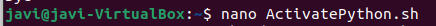
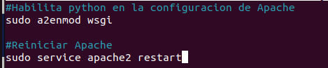
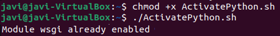

## Apartado 9:
1.Primero crearemos la base de datos con este comando:  


2.Ahora creamos el Script de la base de datos.  


3.Guardamos y le damos permisos y ejecutamos:  


4.Ahora si ponemos este comando nos pedira la contraseña, y vemos si que entra en mysql:  
```
mysql -u javier -p
```  


5.Si introducimos SHOW DATABASES nos mostrara nuestras tablas de la base de datos.  


6.Continuamos con python, creamos el archivo para Python :  


7.Ahora, debemos automatizar la habilitacion de Python.  


8.Por ultimo debemos darle los permisos y ejecutar.  



